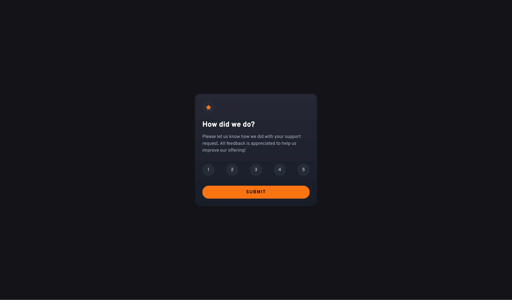
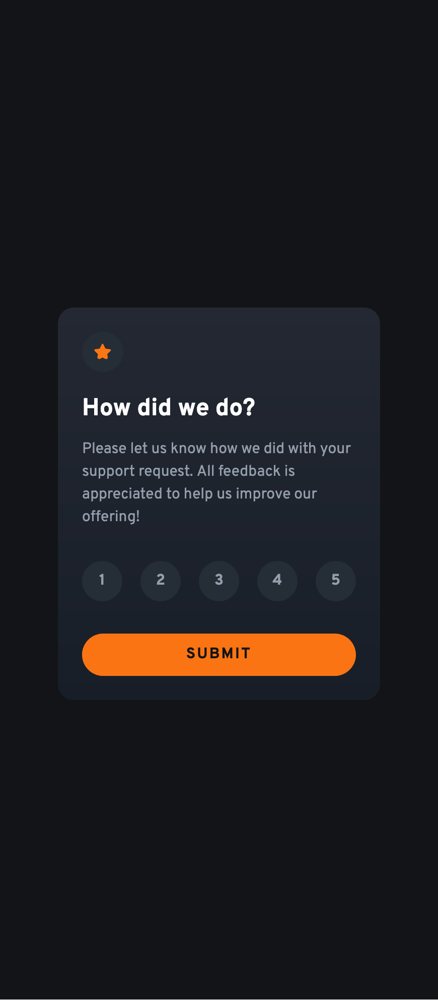

# Frontend Mentor - Interactive rating component solution

This is a solution to the [Interactive rating component challenge on Frontend Mentor](https://www.frontendmentor.io/challenges/interactive-rating-component-koxpeBUmI). Frontend Mentor challenges help you improve your coding skills by building realistic projects.

## Table of contents

- [Frontend Mentor - Interactive rating component solution](#frontend-mentor---interactive-rating-component-solution)
  - [Table of contents](#table-of-contents)
  - [Overview](#overview)
    - [The challenge](#the-challenge)
    - [Screenshot](#screenshot)
    - [Links](#links)
  - [My process](#my-process)
    - [Built with](#built-with)
    - [What I learned](#what-i-learned)
  - [Author](#author)

**Note: Delete this note and update the table of contents based on what sections you keep.**

## Overview

### The challenge

Users should be able to:

- View the optimal layout for the app depending on their device's screen size
- See hover states for all interactive elements on the page
- Select and submit a number rating
- See the "Thank you" card state after submitting a rating

### Screenshot




### Links

- Solution URL: [https://www.frontendmentor.io/solutions/responsive-interactive-rating-component-3lWhbFIRef](https://www.frontendmentor.io/solutions/responsive-interactive-rating-component-3lWhbFIRef)
- Live Site URL: [https://fr-ux-en.github.io/interactive-rating-component/](https://fr-ux-en.github.io/interactive-rating-component/)

## My process

### Built with

- Semantic HTML5 markup
- CSS custom properties
- Flexbox
- CSS Grid
- Mobile-first workflow
- SCSS

### What I learned

Use this section to recap over some of your major learnings while working through this project. Writing these out and providing code samples of areas you want to highlight is a great way to reinforce your own knowledge.

To see how you can add code snippets, see below:

```html
<form
  id="rating-form"
  aria-labelledby="rating-heading"
>
  <h1 id="rating-heading">How did we do?</h1>
</form>
<legend class="sr-only">Rate your experience from 1 to 5</legend>
```

```css
.sr-only {
  position: absolute;
  width: 1px;
  height: 1px;
  padding: 0;
  margin: -1px;
  overflow: hidden;
  clip: rect(0, 0, 0, 0);
  white-space: nowrap;
  border: 0;
}
```

## Author

- LinkedIn - [Daniel Lee](https://www.linkedin.com/in/uniqueimaginate/)
- Frontend Mentor - [@FR-UX-EN](https://www.frontendmentor.io/profile/FR-UX-EN)
